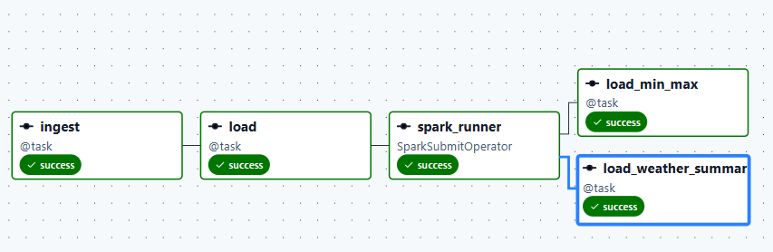

# cities_weather_ETL_pipline
this project is about developing a weather ETL pipline using apache airflow

# Weather ETL Pipeline (Open-Meteo → S3 → Spark → PostgreSQL)

An Airflow-orchestrated ETL pipeline that pulls daily weather data for a list of
cities from the [Open-Meteo](https://open-meteo.com/) API, lands the raw data in
S3 (bronze layer), transforms it with Apache Spark (silver layer), and loads the
results into PostgreSQL (gold layer).


| Stage | Tool | Layer | Format |
|---|---|---|---|
| Extract | Open-Meteo HTTP API | — | JSON → CSV |
| Load (raw) | AWS S3 | Bronze | CSV |
| Transform | Apache Spark | Silver | CSV |
| Load (final) | PostgreSQL | Gold | SQL table |

---

## 1. Architecture

```
Open-Meteo API
      │  (ingest.py)
      ▼
Local CSV  ──────────────►  S3 bucket "airflow"           (bronze)
                                     │
                                     ▼
                          Spark transform (transform.py)   (silver)
                                     │
                       ┌─────────────┴─────────────┐
                       ▼                             ▼
             weather_summary CSV              min_max CSV
                       │                             │
                       ▼                             ▼
              PostgreSQL table               PostgreSQL table   (gold)
         {country}_weather_summary_*      {country}_weather_min_max_*
```

Orchestration is handled by a single Airflow DAG (`dag_weather_to_s3.py`) that
chains an ingestion task, an S3 load task, a Spark transformation task, and two
parallel PostgreSQL load tasks.

---

## 2. Components

### 2.1 `ingest.py` — Extraction

Pulls current-day weather for a list of cities and writes them to a local CSV.

**`get_city_weather(city, count, country) -> dict`**
1. Calls the Open-Meteo **geocoding API** to resolve a city name to
   latitude/longitude and to confirm the country it belongs to.
2. If the resolved country doesn't match the expected `country` argument, the
   city is skipped (prints a warning and returns `None`).
3. Calls the Open-Meteo **forecast API** for that lat/long, requesting
   `weather_code`, `temperature_2m_min`, and `temperature_2m_max` for a single
   forecast day.
4. Returns a dict: `city`, `country`, `time`, `max_temp`, `min_temp`.

**`run(file, country, dest_file)`**
- Reads a newline-delimited list of city names from `file`.
- Calls `get_city_weather` for each city, skipping any that return `None`.
- Assembles the results into a `pandas.DataFrame` and writes it to `dest_file`
  as CSV (no index column).

**Inputs:** `dags/data/{country}_cities.txt` — one city name per line.
**Output:** `dags/results/{country}_cities.csv`

### 2.2 `transform.py` — Transformation (Apache Spark)

A PySpark batch job, invoked with the target `country` as `sys.argv[1]`.

1. Reads `dags/results/{country}_cities.csv` into a DataFrame using an explicit
   schema (`city`, `country`, `time`, `max_temp`, `min_temp`).
2. **Global min/max analysis (`df_min_max`):** finds the overall maximum
   `max_temp` and overall minimum `min_temp` across all cities, then filters
   the DataFrame down to the row(s) that hit either extreme.
3. **Hot/cold classification (`hot_cold_df`):**
   - Computes `mean_temp` per city as `round((max_temp + min_temp) / 2, 2)`.
   - Computes a single reference `mean_temp` from the overall max/min.
   - Labels each city `hot`, `soft` (cold), or `moderate` relative to that
     reference value.
4. Writes both results out as CSV (Spark's multi-part CSV output):
   - `dags/results/{country}_weather_summary.csv/` — hot/cold classification
   - `dags/results/{country}_weather_info.csv/` — min/max extremes

### 2.3 `dag_weather_to_s3.py` — Orchestration (Airflow DAG)

**DAG id:** `weather_to_aws_S3_v23`
**Schedule:** `@daily`, starting `2026-08-04`, `catchup=False`,
created paused (`is_paused_upon_creation=True`).
**Default args:** owner `mahmoud hussein`, `retries=5`, `retry_delay=2 min`.

Currently hard-coded to `country = "germany"`.

**Task graph:**

```
ingest() >> load() >> spark_transform >> [load_weather_summary(), load_min_max()]
```

| Task | Type | Description |
|---|---|---|
| `ingest` | `@task` (PythonOperator via TaskFlow) | Calls `scripts.ingest.run()` to produce the local CSV of city weather data. |
| `load` | `@task` | Uploads the local CSV to the `airflow` S3 bucket via `S3Hook` (conn: `aws_default_2`), keyed as `{country}_cities_{date}.csv`. `replace=True` — noted in the code as **for testing only**, should be `False` in production. |
| `spark_transform` | `SparkSubmitOperator` | Runs `transform.py` on the Spark cluster (conn: `spark_default`), passing `country` as an application argument. |
| `load_weather_summary` | `@task` | Uses `PostgresHook` (conn: `postgres_localhost`) to `CREATE TABLE IF NOT EXISTS {country}_weather_summary_{date}` and full-loads the hot/cold classification CSV via `COPY ... FROM STDIN`. |
| `load_min_max` | `@task` | Same pattern as above, loading the min/max extremes CSV into `{country}_weather_min_max_{date}`. |

Both PostgreSQL load tasks run **in parallel** after `spark_transform`
completes, since they're independent of one another.

**Required Airflow connections:**
- `aws_default_2` — AWS credentials for the S3 bucket `airflow`
- `spark_default` — Spark cluster connection (host set to `local[*]` per the
  in-code comment)
- `postgres_localhost` — target PostgreSQL instance

---

## 3. Data Schemas

### Bronze (`ingest.py` output / `{country}_cities.csv`)
| Column | Type |
|---|---|
| city | string |
| country | string |
| time | date |
| max_temp | float |
| min_temp | float |

### Gold — `{country}_weather_summary_{date}`
| Column | Type |
|---|---|
| id | serial PK |
| city | varchar(250) |
| country | varchar(250) |
| date | date |
| max_temp | float |
| min_temp | float |
| mean_temp | float |
| weather_condition | varchar(50) — `hot` / `soft` / `moderate` |

### Gold — `{country}_weather_min_max_{date}`
| Column | Type |
|---|---|
| id | serial PK |
| city | varchar(250) |
| country | varchar(250) |
| date | date |
| max_temp | float |
| min_temp | float |

---

## 4. Running Locally

1. Place a plain-text list of city names at `dags/data/{country}_cities.txt`
   (one per line).
2. Configure the Airflow connections listed in section 2.3.
3. Unpause `weather_to_aws_S3_v23` in the Airflow UI, or trigger it manually.
4. Outputs land in:
   - S3 bucket `airflow`, key `{country}_cities_{date}.csv`
   - PostgreSQL tables `{country}_weather_summary_{date}` and
     `{country}_weather_min_max_{date}`

---

## 4. Actual Execution


## 6. Repository Structure
 
```
cities_weather_ETL_pipline/
├── Dockerfile                      # Container image for the Airflow environment
├── LICENSE
├── README.md
├── requirements.txt                # Python dependencies
├── docs/
│   ├── workflow arch.png           # Pipeline architecture diagram (used above)
│   ├── dag.PNG                     # Airflow DAG graph view screenshot
│   └── postgres tables.PNG         # Screenshot of loaded PostgreSQL tables
└── dags/
    ├── dag_weather_to_s3.py        # Main Airflow DAG definition
    ├── data/
    │   └── germany_cities.txt      # Input list of city names for ingestion
    ├── results/                    # Generated pipeline outputs (bronze/silver CSVs)
    │   ├── germany_cities.csv              # Bronze: raw ingested weather data
    │   ├── germany_weather_info.csv/       # Silver: min/max extremes (Spark output dir)
    │   └── germany_weather_summary.csv/    # Silver: hot/cold classification (Spark output dir)
    └── scripts/
        ├── __init__.py
        ├── ingest.py                # Extraction logic (Open-Meteo API → CSV)
        └── transform.py             # Spark transformation logic
```
